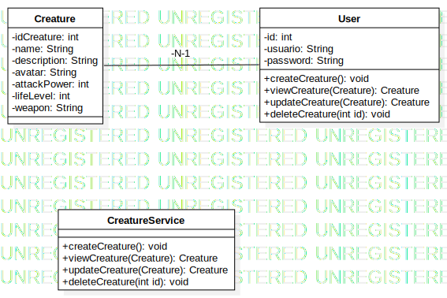

# Role-game

Este es el diagrama de clases de la solución que gestiona la creación, visualización, modificación y eliminación de criaturas.

### Explicación del Diagrama

- **Creature**: Esta clase representa las criaturas en el sistema. Tiene atributos como `idCreature`, `name`, `description`, `avatar`, `attackPower`, `lifeLevel`, y `weapon` que describen la criatura.
  
- **CreatureService**: Esta clase es responsable de gestionar las criaturas. Tiene métodos como `createCreature()`, `viewCreature()`, `updateCreature()`, y `deleteCreature()` para realizar las acciones correspondientes sobre las criaturas.

- **User**: Representa a los usuarios del sistema. Los usuarios pueden crear, ver, modificar y eliminar criaturas. Cada usuario puede tener muchas criaturas asociadas.

### Relaciones:

- Un **Usuario** puede crear y manejar muchas criaturas (relación 1 a muchos).
- **CreatureService** es responsable de manejar las operaciones de las criaturas y se relaciona directamente con ellas.
